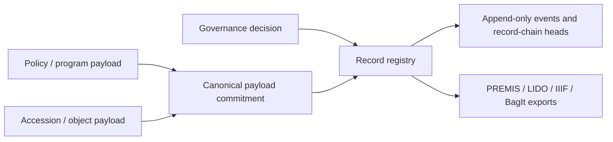

# On-chain design requirements

This document defines the migration target; it is not a deployed-contract claim.

## Architecture

Use a small append-only registry, not a monolithic museum database. Rich payloads live as canonical JSON or standard archival packages on content-addressed storage; the contract records identity, schema, hash, URI, authority, effective time, and chain lineage.

## Record families

Museum-native families:

- `MUSEUM_POLICY`
- `GOVERNANCE_DECISION`
- `APPROVED_COLLECTION`
- `ACCESSION_PROGRAM`
- `PROGRAM_OUTCOME`

Shared Stream families are reused unchanged:

- `ACCESSION` / `STREAM_ACCESSION_V1`
- `WORK_DESCRIPTION` / `STREAM_WORK_DESCRIPTION_V1`
- `RIGHTS_STATEMENT` / `STREAM_RIGHTS_V1`
- preservation Objects, Events, Agents, Rights / `STREAM_PREMIS_V3_PROFILE`
- IIIF, condition, exhibition, loan, dossier, acquisition-packet, and BagIt profiles.

## Core storage

Each write should contain the Stream `CollectionRecord` envelope or a byte-for-byte compatible generic Museum record. Required state:

- existence and retrieval by `recordHash`;
- latest record by `(recordType, subjectId)`;
- append-only chain head by record lane;
- duplicate-record rejection;
- schema registry and immutable schema-document hash;
- algorithm/canonicalization registry with no identifier reuse;
- supersession lineage in the payload, never mutation in place;
- state-readable payload pointers so reconstruction does not depend only on old logs.

## Authority

Authorization is family-specific:

- governance decisions and policy: approved Museum governance executor;
- program outcomes: approved program decision source;
- custody/accession statements: current Museum custody authority, normally Safe/contract-wallet compatible;
- artist assertions and rights grants: artist/rights-holder signatures or explicit instrument evidence;
- independent preservation evidence: attributable independent attestor lane;
- corrections: the original authority or an explicitly authorized successor, with supersession.

All relayed signed writes must support EIP-712 and ERC-1271, unordered signer-scoped nonces, deadlines, and signer-scoped nonce revocation. On-chain ownership remains authoritative for custody; record writers cannot change token ownership or artwork bytes.

## Subject identity

- On-chain objects use the Stream token-subject derivation and CAIP-19-shaped citation.
- Pre-mint selected outcomes use stable Museum outcome IDs and may later be linked to, but never replaced by, a token subject.
- An accession lot may include multiple object subjects.
- A correction or migration never re-identifies the original object.

## Migration from GitHub

1. Freeze a repository release manifest.
2. Canonicalize each JSON payload with RFC 8785 JCS.
3. Compute Keccak-256 and construct the Stream `HashRef` (`algorithm = 1`).
4. Publish payloads and schemas to content-addressed storage.
5. Write Museum-native governance/program records.
6. Write object records through the shared Stream families.
7. Record the repository commit and release-manifest hash as release-binding provenance.
8. Regenerate all public indexes from chain state plus committed payloads.

The migration is complete only when a third party can reproduce record hashes and exports without GitHub, the original operator, or a marketplace.
